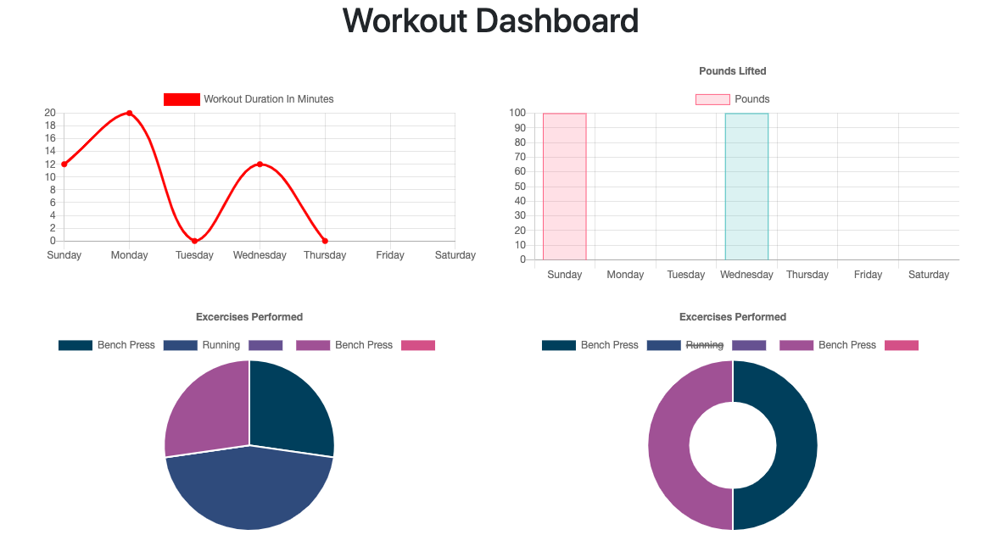

# Fitness-Tracker
A fitness tracker app that allows users to create new workouts, and add in as many exercises as they want into a workout. It records the type of exercise, the duration of it, and the other metrics such as distance if it's a cardio type of exercise, or number of reps, sets, weight of weights used etc. Users can also choose to add on exercises to the last workout, or create an entirely new workout. The latest summation of the metrics of the last workout will then be shown on the homepage for users to keep track. There is also a dashboard that shows the metrics in pie charts and graphs. This allows users to have a good overall view of their workouts.
## GitHub: https://github.com/wsglobe/Fitness-Tracker
## Heroku: https://fitness-tracker-002.herokuapp.com
## Screenshot of application in use:
### Create New Workout

### Resistance workout 

### Last Work Results

### Workout Dashboard

